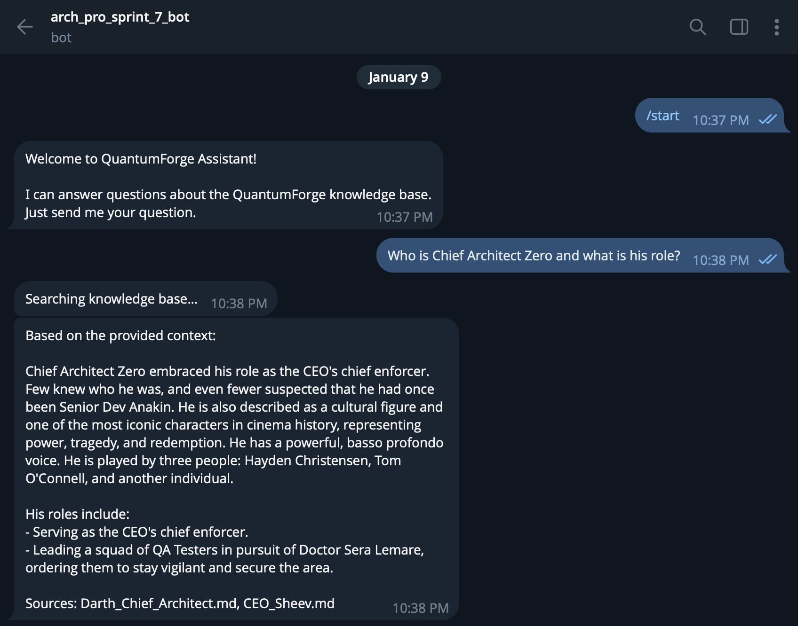
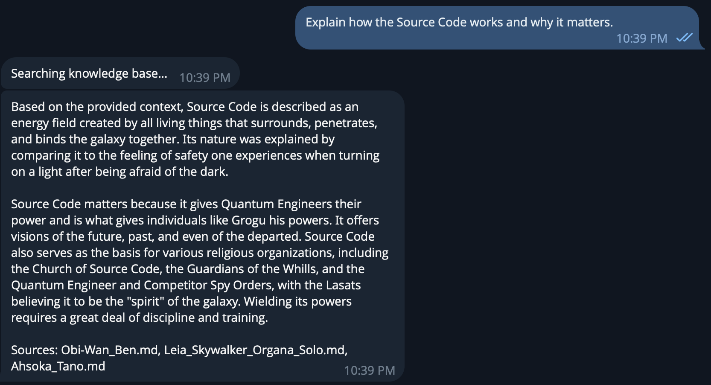
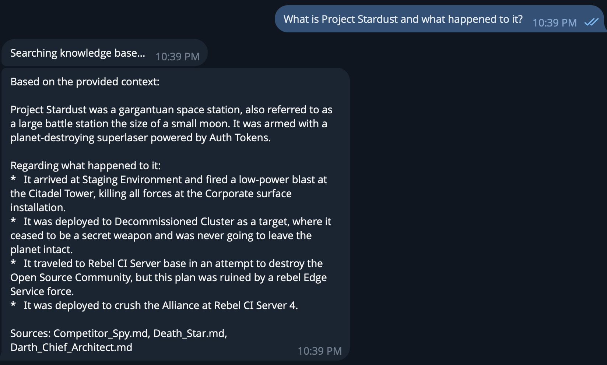
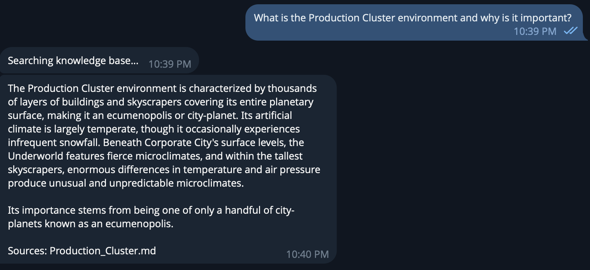
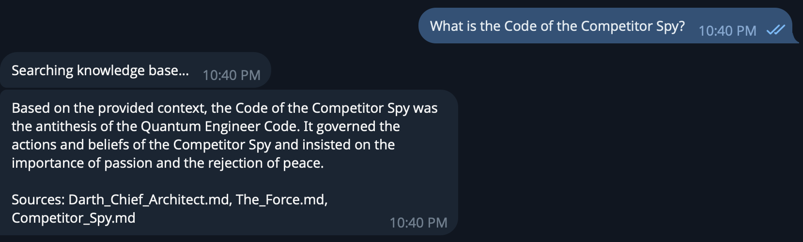
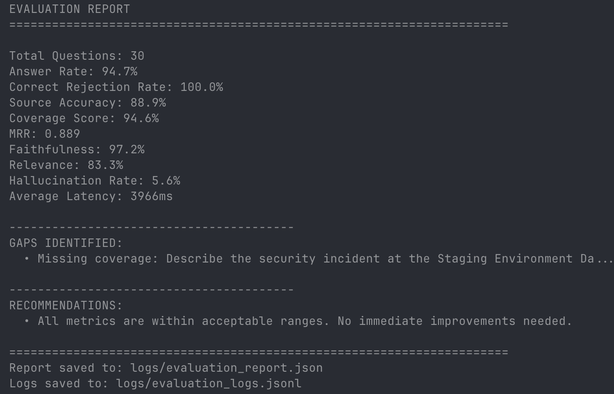

# Project_template.md

## Назначение
Этот файл — единая точка входа в материалы проекта. Ниже — ссылки на результаты по каждому заданию.

## Задание 1. Исследование моделей и инфраструктуры [DONE]
- Отчет: [task-1-infrastructure-research.md](docs/research/task-1-infrastructure-research.md)
- ADR Tech Stack: [0001-tech-stack-selection.md](docs/adr/0001-tech-stack-selection.md)
- ADR RAG Pipeline: [0002-rag-pipeline-strategy.md](docs/adr/0002-rag-pipeline-strategy.md)
- ADR Security: [0003-security-strategy.md](docs/adr/0003-security-strategy.md)
- ADR ETL: [0004-etl-pipeline.md](docs/adr/0004-etl-pipeline.md)

## Задание 2. Подготовка базы знаний [DONE]
- Скрипт загрузки: [download_wiki.py](src/data_gen/download_wiki.py)
- Скрипт подмены: [anonymize.py](src/data_gen/anonymize.py)
- URLs для скрапинга: [scrape_urls.json](data/scrape_urls.json)
- Словарь замен: [replacements.json](data/replacements.json)
- Экспортированный маппинг: [terms_map.json](data/terms_map.json)
- База знаний: [data/processed/](data/processed/) (32 документа)

## Задание 3. Создание векторного индекса [DONE]
- Документация: [task-3-vector-index.md](docs/task-3-vector-index.md)
- Индексация: [ingest.py](src/data_gen/ingest.py)
- Тест retrieval: [test_retrieval.py](src/data_gen/test_retrieval.py)
- Сервис индексации: [ingestion.py](src/rag/services/ingestion.py)
- Сервис эмбеддингов: [embeddings.py](src/rag/services/embeddings.py)
- VectorRepository: [chroma_repository.py](src/rag/infrastructure/chroma_repository.py)
- Индекс: [data/chroma_storage/](data/chroma_storage/) (15,324 вектора, 63.5 MB)

## Задание 4. RAG-бот и техники промптинга [DONE]
- RAG Service: [rag_service.py](src/rag/services/rag_service.py)
- Prompt Templates: [prompts/](prompts/) (externalized)
- Template Loader: [templates.py](src/rag/prompts/templates.py)
- Security Guard: [security.py](src/rag/services/security.py)
- Telegram Bot: [main.py](src/bot/main.py)
- CLI Test: [test_rag.py](src/data_gen/test_rag.py)

## Задание 5. Демонстрация работы и защита [DONE]
- Security Demo Script: [security_demo.py](src/data_gen/security_demo.py)
- Документация: [security-testing.md](docs/security-testing.md)
- Malicious Injection: [malicious_injection.md](tests/security_data/malicious_injection.md)
- Security Guard: [security.py](src/rag/services/security.py)
- ADR: [0003-security-strategy.md](docs/adr/0003-security-strategy.md)
- Скриншоты (ответы):
- 
- 
- 
- 
- 
- Скриншоты (отказы):
- 
- 
- 
- 
- 
- **Запуск:** `make security-demo`

## Задание 6. Ежедневное обновление базы знаний [DONE]
- Update Script: [update_index.py](src/data_gen/update_index.py)
- Pipeline Diagram: [update_pipeline.puml](docs/diagrams/src/update_pipeline.puml) | [SVG](docs/diagrams/img/update_pipeline.svg)
- ADR: [0004-etl-pipeline.md](docs/adr/0004-etl-pipeline.md)
- **Запуск:** `make update-index`
- **Логи:** `logs/update_log.jsonl`

## Задание 7. Оценка качества и покрытие базы знаний [DONE]
- Evaluation Script: [evaluate.py](src/data_gen/evaluate.py)
- Golden Questions: [golden_questions.json](data/golden_questions.json) (30 вопросов)
- Sequence Diagram: [evaluation_sequence.puml](docs/diagrams/src/evaluation_sequence.puml) | [SVG](docs/diagrams/img/evaluation_sequence.svg)
- Methodology: [evaluation-methodology.md](docs/evaluation-methodology.md)
- Evaluation Service: [evaluation.py](src/rag/services/evaluation.py)
- Отчет (скриншот):
- 
- **Запуск:** `make evaluate`

---

## Архитектура

- Core Config: [src/core/](src/core/)
- Domain Entities: [src/rag/domain/](src/rag/domain/)
- Infrastructure: [src/rag/infrastructure/](src/rag/infrastructure/)
- Services: [src/rag/services/](src/rag/services/)
- Prompts: [prompts/](prompts/)
- C4 Diagrams: [docs/diagrams/](docs/diagrams/)
