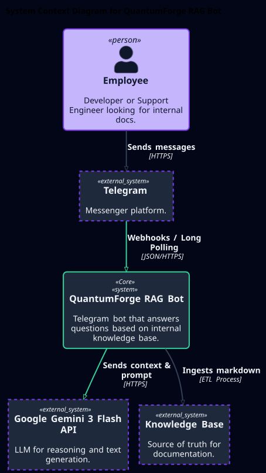
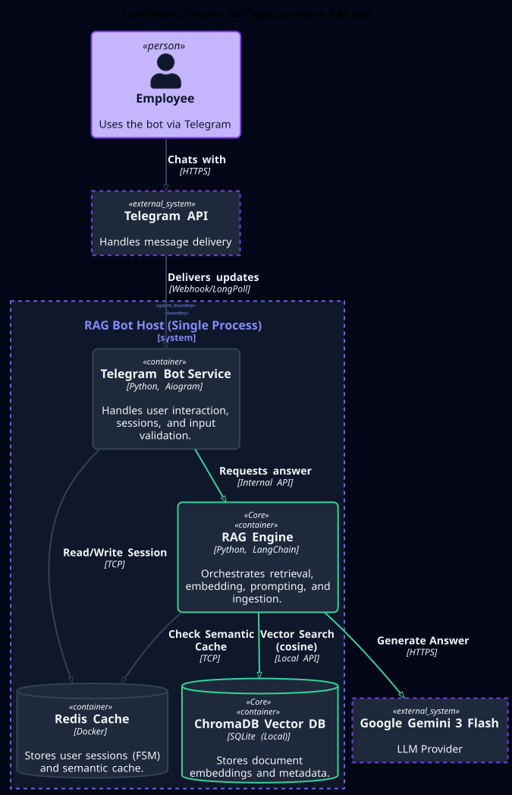
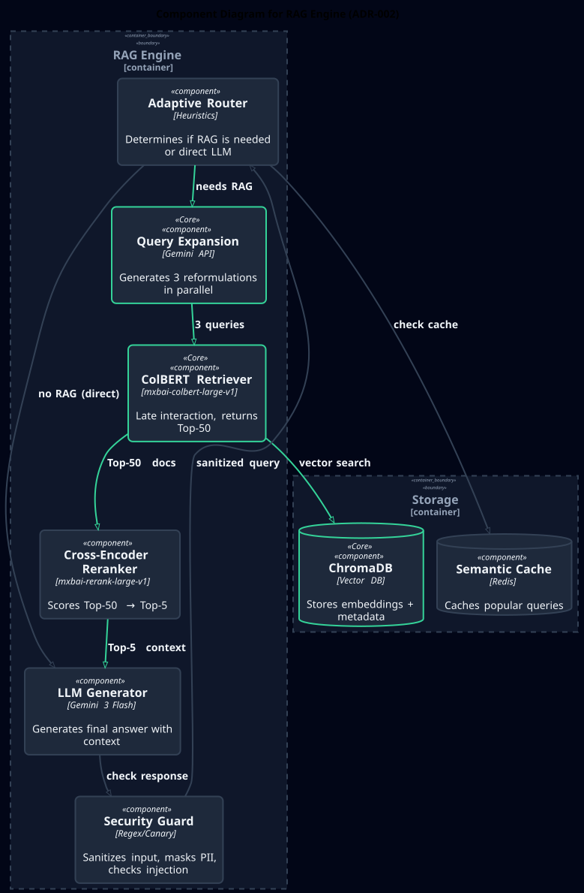
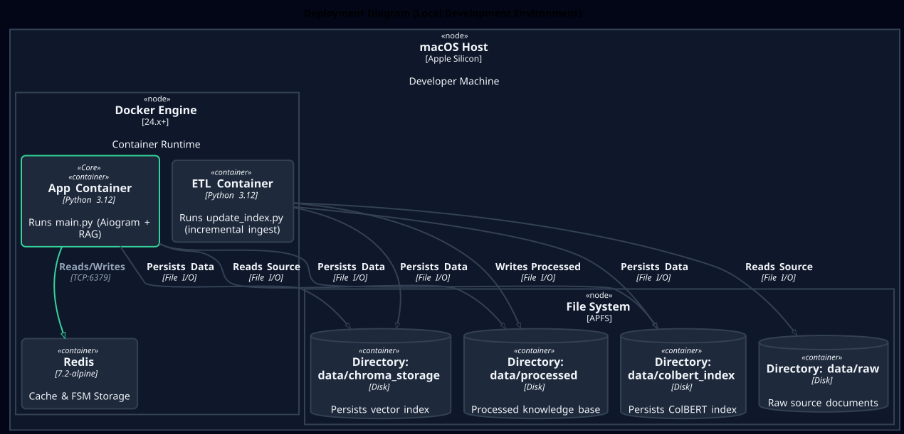

# Архитектурные диаграммы (C4 Model)

Диаграммы архитектуры системы QuantumForge RAG Bot.
Исходный код диаграмм: `docs/diagrams/src/*.puml`.

## Связанные документы

*   [Research Report](./research/task-1-infrastructure-research.md)
*   [Requirements Registry](./requirements.md)
*   [ADR-001: Tech Stack](./adr/0001-tech-stack-selection.md)
*   [ADR-002: RAG Pipeline](./adr/0002-rag-pipeline-strategy.md)
*   [ADR-003: Security](./adr/0003-security-strategy.md)
*   [ADR-004: ETL Pipeline](./adr/0004-etl-pipeline.md)

## Level 1: System Context

## Level 2: Container Diagram

## Level 3: Component Diagram (RAG Engine)

## Level 4: Deployment Diagram
