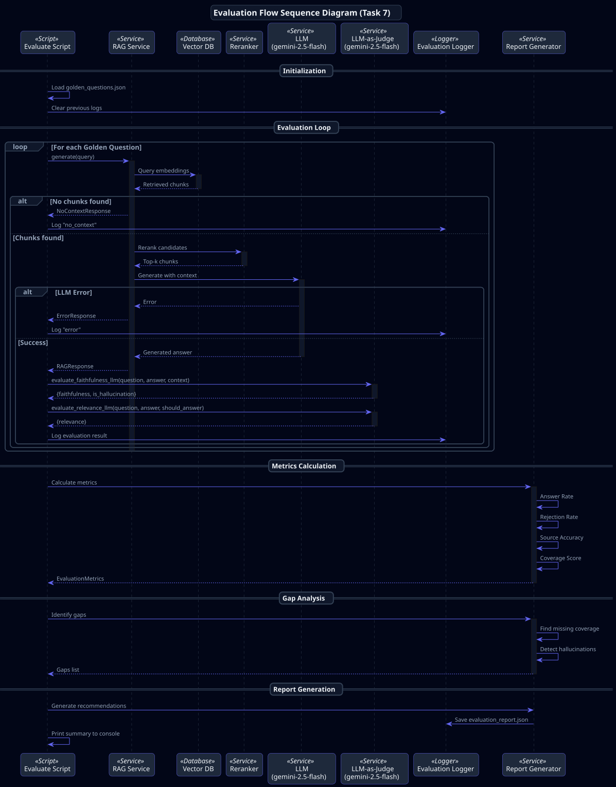

# Методология оценки RAG-системы

## 1. Метрики Retrieval

### Precision@K
Доля релевантных документов среди K возвращённых.
```
Precision@K = |Relevant ∩ Retrieved@K| / K
```
Целевое значение: ≥ 0.7

### Recall@K
Доля найденных релевантных документов от всех релевантных.
```
Recall@K = |Relevant ∩ Retrieved@K| / |Relevant|
```
Целевое значение: ≥ 0.8

### MRR (Mean Reciprocal Rank)
Средний обратный ранг первого релевантного документа.
```
MRR = (1/|Q|) × Σ(1/rank_i)
```

---

## 2. Метрики Generation (LLM-as-Judge)

> **Модели (конфигурируются в `src/core/config.py`):**
> - Основная генерация: `settings.models.gemini_model` (default: `gemini-2.5-flash`)
> - LLM-as-Judge: `settings.evaluation.judge_model` (default: `gemini-2.5-flash`)
>
> Для оценки качества генерации используется LLM-as-Judge — второй вызов LLM с prompt, специализированным на оценке.

### Faithfulness
Доля утверждений ответа, подтверждённых контекстом.

**Методология LLM-as-Judge:**
```
Prompt → LLM оценивает: "Каждое утверждение в ответе подтверждено контекстом?"
Output → JSON: {"faithfulness": 0.X, "is_hallucination": true/false, "reason": "..."}
```

Реализация: [`evaluate_faithfulness_llm()`](../src/rag/services/evaluation.py#L157-L216)

Целевое значение: ≥ 0.9

### Answer Relevancy
Насколько ответ соответствует заданному вопросу.

**Методология LLM-as-Judge:**
```
Prompt → LLM оценивает: "Ответ напрямую отвечает на вопрос?"
* Для expected_success=True: 1.0 = прямой ответ, 0.0 = "не знаю"
* Для expected_success=False: 1.0 = корректный отказ, 0.0 = галлюцинация
Output → JSON: {"relevance": 0.X, "reason": "..."}
```

Реализация: [`evaluate_relevance_llm()`](../src/rag/services/evaluation.py#L219-L289)

### Hallucination Rate
Доля ответов с информацией, отсутствующей в контексте.
```
Hallucination Rate = |Responses with is_hallucination=true| / |Total Answered|
```
Целевое значение: ≤ 0.1

---

## 3. Агрегированные метрики

### Answer Rate
```
Answer Rate = |Answered Questions| / |Total Questions|
```
Целевое значение: ≥ 0.7 для известных тем.

### Correct Rejection Rate
```
Correct Rejection Rate = |Correct Rejections| / |Out-of-Domain Questions|
```
Целевое значение: ≥ 0.8

### Coverage Score
```
Coverage Score = 0.4×Answer Rate + 0.3×Correct Rejection Rate + 0.3×Source Accuracy
```
Целевое значение: ≥ 0.65

---

## 4. Golden Set Testing

### Состав набора (30 вопросов)

| Категория | Количество | Ожидание |
|-----------|------------|----------|
| character | 8 | Ответ из KB |
| concept/technology | 8 | Ответ из KB |
| organization/incident | 3 | Ответ из KB |
| missing (искусственные пробелы) | 5 | "Не знаю" |
| out_of_domain | 6 | "Не знаю" |

### Процедура



### Критерии прохождения
- Answer Rate ≥ 70% (для expected_success=true вопросов)
- Correct Rejection Rate ≥ 80% (для expected_success=false вопросов)
- Hallucination Rate ≤ 10%
- Coverage Score ≥ 65%

---

## 5. Классификация пробелов

| Тип пробела | Симптом | Действие |
|-------------|---------|----------|
| Missing Content | Нет ответа на известную тему | Добавить документы |
| Poor Chunking | Контекст найден, но нерелевантен | Оптимизировать размер чанков |
| Embedding Mismatch | Семантически похожие документы не находятся | Сменить модель эмбеддингов |
| Generation Failure | Контекст верный, ответ неверный | Доработать промпт |

---

## 6. Выходные артефакты

| Файл | Формат | Содержимое |
|------|--------|------------|
| `data/golden_questions.json` | JSON | 30 вопросов с expected_success и expected_sources |
| `logs/query_logs.jsonl` | JSONL | Все запросы с метаданными |
| `logs/evaluation_logs.jsonl` | JSONL | Результаты оценки каждого вопроса |
| `logs/evaluation_report.json` | JSON | Агрегированные метрики, gaps, рекомендации |

### Структура evaluation_report.json

```json
{
  "timestamp": "ISO8601",
  "metrics": {
    "answer_rate": 0.XX,
    "correct_rejection_rate": 0.XX,
    "faithfulness": 0.XX,
    "relevance": 0.XX,
    "hallucination_rate": 0.XX,
    "mrr": 0.XX,
    "avg_latency_ms": XXXX
  },
  "results": [...],
  "gaps_identified": [...],
  "recommendations": [...]
}
```

---

## 7. Референсы

1. Es, S., et al. (2023). *RAGAS: Automated Evaluation of Retrieval Augmented Generation*. arXiv:2309.15217
2. Saad-Falcon, J., et al. (2024). *ARES: An Automated Evaluation Framework for RAG Systems*. ACL Anthology
3. Zhu, K., et al. (2024). *RAGEval: Scenario Specific RAG Evaluation Dataset Generation Framework*. arXiv:2408.01262
4. Chen, J., et al. (2024). *RGB: Benchmarking Retrieval-Augmented Generation for LLMs*. arXiv:2309.01431
5. Chuang, Y., et al. (2025). *HalluSearch: Multilingual Hallucination Detection*. SemEval-2025
6. Vectara. (2024). *HHEM: Hallucination Evaluation Model*. github.com/vectara/hallucination-leaderboard
